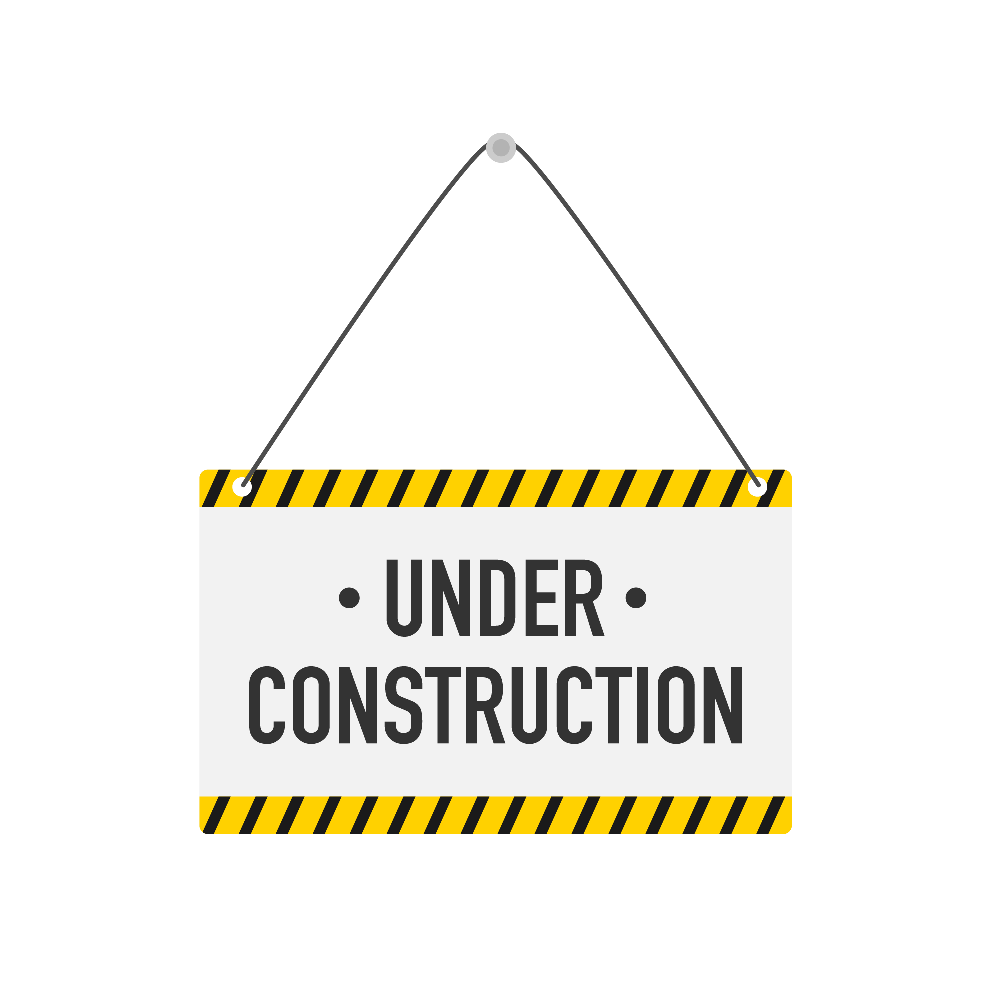

<h3 align="center">Frontend Mentor Challenge #3 </h3>

  

<h3 align="center"> Frontend Mentor - Single Price Grid Component</h3>

---

[Design preview for the Single Price Grid Component Coding Challenge]

---

[The Result]

---

<h3 align="center">Languages and Tools:</h3>

 </a>    </a>    </a>  
 

<h3 align="center">Welcome! 👋</h3>

Thanks for checking out this front-end coding challenge.

[Frontend Mentor](https://www.frontendmentor.io) challenges help you improve your coding skills by building realistic projects.

**To do this challenge, you need a basic understanding of HTML and CSS.** 

<h3 align="center">The Challenge</h3>

Your challenge is to build out this QR code component and get it looking as close to the design as possible.

You can use any tools you like to help you complete the challenge. So if you've got something you'd like to practice, feel free to give it a go.

Want some support on the challenge? [Join our Slack community](https://www.frontendmentor.io/slack) and ask questions in the **#help** channel.

<h3 align="center">Connect with me:</h3>

